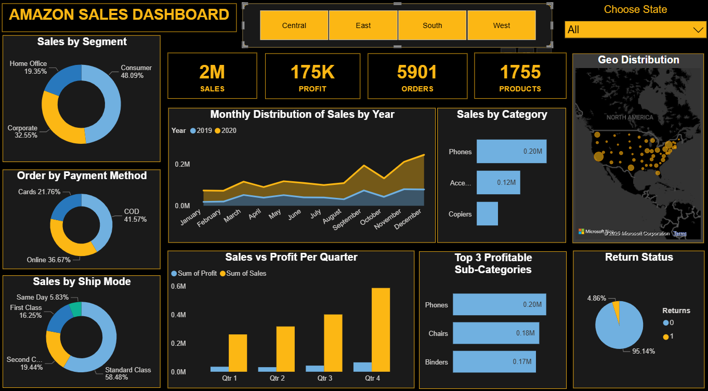

# 🛒 Amazon-Sales-Performance-Analysis

## 📝 Overview

This project analyzes **Amazon store sales data** to uncover meaningful insights into product performance, revenue trends, and customer behavior. Using **Power BI**, I created an interactive dashboard that helps visualize sales metrics, profit distribution, and regional performance. The analysis provides actionable insights to improve business strategies and optimize sales outcomes.

## ✨ Key Features

* 💰 **Sales Overview** – Track total sales, quantity, and profit across different product categories.
* 🏷️ **Product Insights** – Identify top-selling products and high-profit categories.
* 🌍 **Regional Analysis** – Analyze sales and profit distribution by city, state, or region.
* 📅 **Time-Based Trends** – Explore how sales and profits fluctuate across months and years.
* 📊 **Interactive Dashboard** – Use filters, slicers, and drill-through options to explore detailed insights.

## ✅ Dataset Information

* **Amazon Store Sales Data.xlsx** used as the main dataset.
* Contains sales-related details including order ID, product category, customer name, quantity, discount, and profit.
* Data was cleaned, formatted, and validated to ensure accuracy and consistency.
* Enables meaningful analysis of sales performance and customer purchase patterns.

## 🛠️ Tools Used

* **Power BI** – Designed and developed interactive visual dashboards for analysis.
* **Excel** – Used for data preprocessing, cleaning, and validation before visualization.

## 🚀 How to Use

1. Open `Amazon Sales Dashboard.pbix` in **Power BI Desktop**.
2. Interact with filters and slicers to explore sales data by region, category, or product.
3. Review overall performance, profit margins, and monthly sales trends.

## 🗂️ File Structure

* `Amazon Store Sales Data.xlsx`: Dataset containing Amazon sales information.
* `Amazon Sales Dashboard.pbix`: Power BI visualization and analysis file.
* `README.md`: Project documentation.

## 📊 Power BI Dashboard

## 🤝 How to Contribute

If you’d like to suggest improvements:

* 🍴 Fork this repository.
* 🛠️ Create a feature branch.
* 📬 Submit a pull request with your changes.

---

👉 This project highlights **data analytics and visualization skills** using Power BI, focusing on **sales trends, profit performance, and customer insights**. It’s valuable for retail businesses aiming to enhance decision-making and sales growth strategies.

